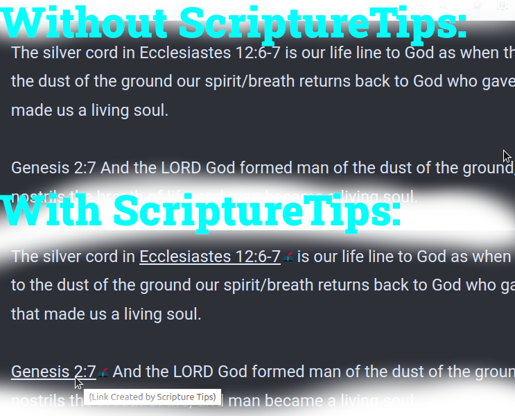

# ScriptureTips Browser Plugin

A browser plugin that scans the page looking for references to scripture and converting those references into URL links that you can click on.

ScriptureTips Browser Plugin has two main functions:

## Real-time Page Scanning

ScriptureTips Browser Plugin will scan any page you are reading, looking for references to scripture, and it will convert those references into links (if they are not already linked). 

This way, you can click on the link to read the scripture, and it saves the time of having to copy/paste, open a new browser window and search for the scripture.

## Blog/Post Link Generator

If you are writing content that contains scripture references, you can process that content before you submit it, so that the links get added to the content automatically. 

This means that your readers can click on the links without having ScriptureTips installed on their browser, and it saves you the time of having to create each link, Eg:

You can use it to generate the links in your posts when blogging or writing on forums. 

It supports [BB Code](https://en.wikipedia.org/wiki/BBCode), [WIKI Markdown](https://en.wikipedia.org/wiki/Markdown) and [HTML](https://en.wikipedia.org/wiki/HTML) markup languages.

## Flexible Configuration

Any site can be excluded by marking the checkbox when you click the extension's button while visiting the website.

You can create custom services using reference placeholders in the configuration:

## How to install

In Chrome Extensions menu, enable "Developer Settings" and click the "Load Unpacked" button. Navigate to the chrome folder in the unzipped code that you have downloaded from the [Github Project Page](https://github.com/adonai-reigns/ScriptureTips-BrowserPlugin).

-or-

Install from the [Google Chrome Webstore](https://chromewebstore.google.com/search/scripture%20tips)

Bugs or feature requests, use the [Github Issue Tracker](https://github.com/adonai-reigns/ScriptureTips-BrowserPlugin/issues).

©2024 - Adonai Reigns [<www.adonai-reigns.life>](https://www.adonai-reigns.life)

